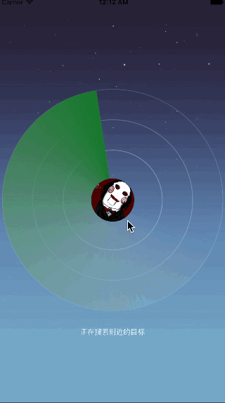

# XHRadarView
Implement an animating RADAR  effect

# Demo


# Installation
```
pod "XHRadarView", :git => "https://github.com/heartfly/XHRadarView.git"
```

# Usage
* Initialization
```
    XHRadarView *radarView = [[XHRadarView alloc] initWithFrame:self.view.bounds];
    radarView.frame = self.view.frame;
    radarView.dataSource = self;
    radarView.delegate = self;
    radarView.radius = 215;
    radarView.backgroundColor = [UIColor colorWithRed:0.251 green:0.329 blue:0.490 alpha:1];
    radarView.backgroundImage = [UIImage imageNamed:@"radar_background"];
    radarView.labelText = @"正在搜索附近的目标";
    [self.view addSubview:radarView];
    _radarView = radarView;
    
    UIImageView *avatarView = [[UIImageView alloc] initWithFrame:CGRectMake(self.view.center.x-39, self.view.center.y-39, 78, 78)];
    avatarView.layer.cornerRadius = 39;
    avatarView.layer.masksToBounds = YES;
    
    [avatarView setImage:[UIImage imageNamed:@"avatar"]];
    [_radarView addSubview:avatarView];
    [_radarView bringSubviewToFront:avatarView];
    
    //目标点位置
    _pointsArray = @[
                    @[@6, @90],
                    @[@-140, @108],
                    @[@-83, @98],
                    @[@-25, @142],
                    @[@60, @111],
                    @[@-111, @96],
                    @[@150, @145],
                    @[@25, @144],
                    @[@-55, @110],
                    @[@95, @109],
                    @[@170, @180],
                    @[@125, @112],
                    @[@-150, @165],
                    @[@-7, @160],
                    ];
    
    [self.radarView scan];
```
* DataSource & Delegate
```
#pragma mark - XHRadarViewDataSource
- (NSInteger)numberOfSectionsInRadarView:(XHRadarView *)radarView {
    return 4;
}
- (NSInteger)numberOfPointsInRadarView:(XHRadarView *)radarView {
    return [self.pointsArray count];
}
- (UIView *)radarView:(XHRadarView *)radarView viewForIndex:(NSUInteger)index {
    UIView *pointView = [[UIView alloc] initWithFrame:CGRectMake(0, 0, 120, 25)];
    
    UIImageView *imageView = [[UIImageView alloc] initWithFrame:CGRectMake(0, 0, 20, 20)];
    [imageView setImage:[UIImage imageNamed:@"point"]];
    [pointView addSubview:imageView];
    return pointView;
}
- (CGPoint)radarView:(XHRadarView *)radarView positionForIndex:(NSUInteger)index {
    NSArray *point = [self.pointsArray objectAtIndex:index];
    return CGPointMake([point[0] floatValue], [point[1] floatValue]);
}

#pragma mark - XHRadarViewDelegate

- (void)radarView:(XHRadarView *)radarView didSelectItemAtIndex:(NSUInteger)index {
    NSLog(@"didSelectItemAtIndex:%lu", (unsigned long)index);
    
}
```
